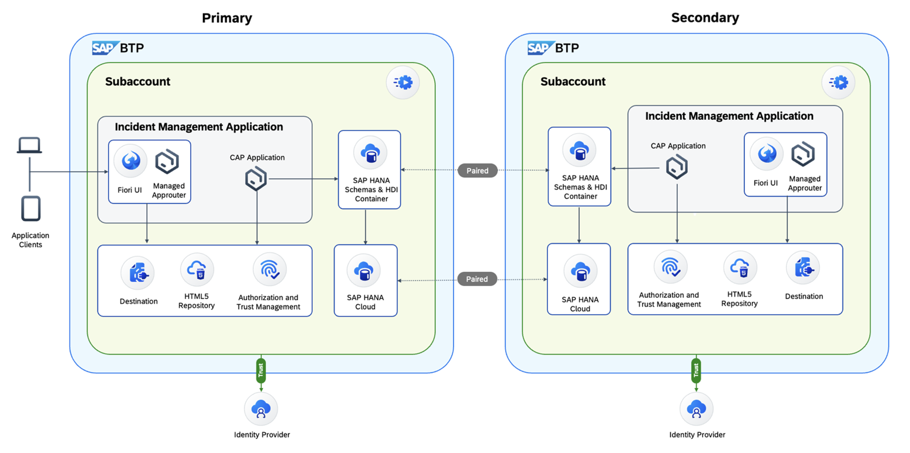

# XP268 - Establish Multi-Region Resilience for Mission-Critical Workloads on SAP BTP

## Description

This repository contains the material for the SAP TechEd 2025 Hands-on. **XP268: Establish multi-region resilience for mission-critical workloads on SAP BTP**. 

Learn how to implement a robust disaster recovery solution using SAP Business Technology Platform's multi-region capabilities to ensure business continuity for your critical applications.

## Overview

This session introduces SAP BTP administrators and developers to managing mission-critical applications that require high availability and disaster recovery capabilities. Mission-critical workloads cannot afford downtime due to their business criticality and need additional protection from incidents or disasters that could affect an entire BTP region.

To minimize downtime in such scenarios, BTP administrators can implement a multi-region setup that enables seamless failover to a secondary BTP region with transparent rerouting of client traffic. This hands-on guides you through the complete process of setting up such an architecture and effectively managing failovers.

### What You'll Learn

This hands-on session covers the essential components of a multi-region disaster recovery solution:

- **Multi-Region Architecture**: Understanding BTP region pairs and subaccount pairing concepts
- **HANA Cloud Replication**: Setting up primary and secondary HANA Cloud instances with automatic data replication
- **Application Deployment**: Deploying CAP applications with redundant setup across regions
- **HDI Container Pairing**: Establishing pairing and replication for database containers
- **Controlled Failover**: Triggering failover procedures and verifying disaster recovery functionality
- **Business Continuity**: Ensuring seamless application operation during regional outages

### Architecture Overview

The hands-on session demonstrates a complete disaster recovery setup using an incident management application deployed across two geographically distant regions (US10 and US11).

 

## Exercises

This hands-on session consists of a series of exercises that will guide you through setting up a complete multi-region disaster recovery solution on SAP BTP. Each exercise builds upon the previous one to create a robust, resilient architecture.

### Session Structure

- **[Exercise 0 - Getting Started with SAP BTP Multi-Region Setup](exercises/ex0/)**
  - Introduction to SAP BTP Multi-Region concepts
  - Environment setup and development space creation
  - Cloud Foundry configuration for primary region

- **[Exercise 1 - Deploy Application in Primary Region](exercises/ex1/)**
  - Configure HANA Cloud instance
  - Build and deploy incident management application
  - Test application functionality in primary region

- **[Exercise 2 - Pairing Secondary Instance and Redundant Application Setup](exercises/ex2/)**
  - Configure Cloud Foundry access for secondary region
  - Create secondary HANA Cloud instance with pairing
  - Verify replication status between regions

- **[Exercise 3 - Deploy Application in Secondary Region](exercises/ex3/)**
  - Deploy application to secondary region in stopped state
  - Configure HDI container pairing
  - Verify disaster recovery setup

- **[Exercise 4 - Trigger Failover to Secondary Region](exercises/ex4/)**
  - Execute controlled failover process
  - Verify application continuity in secondary region
  - Test complete disaster recovery scenario

### Learning Objectives

By completing these exercises, you will:
- ✅ Understand SAP BTP Multi-Region architecture and concepts
- ✅ Set up paired subaccounts across geographically distant regions
- ✅ Deploy applications with redundant infrastructure
- ✅ Configure HANA Cloud replication and HDI container pairing
- ✅ Execute controlled failover procedures
- ✅ Verify business continuity during regional outages

### Prerequisites

- Basic knowledge of SAP BTP and Cloud Foundry
- Familiarity with SAP HANA Cloud
- Understanding of Multi-Target Applications (MTA)

**Start the hands-on session:** Begin with [Exercise 0 - Getting Started](exercises/ex0/) to set up your environment.

**IMPORTANT**

Your repo must contain the .reuse and LICENSES folder and the License section below. DO NOT REMOVE the section or folders/files. Also, remove all unused template assets(images, folders, etc) from the exercises folder. 

## Contributing
Please read the [CONTRIBUTING.md](./CONTRIBUTING.md) to understand the contribution guidelines.

## Code of Conduct
Please read the [SAP Open Source Code of Conduct](https://github.com/SAP-samples/.github/blob/main/CODE_OF_CONDUCT.md).

## How to obtain support

Support for the content in this repository is available during the actual time of the online session for which this content has been designed. Otherwise, you may request support via the [Issues](../../issues) tab.

## License
Copyright (c) 2025 SAP SE or an SAP affiliate company. All rights reserved. This project is licensed under the Apache Software License, version 2.0 except as noted otherwise in the [LICENSE](LICENSES/Apache-2.0.txt) file.
