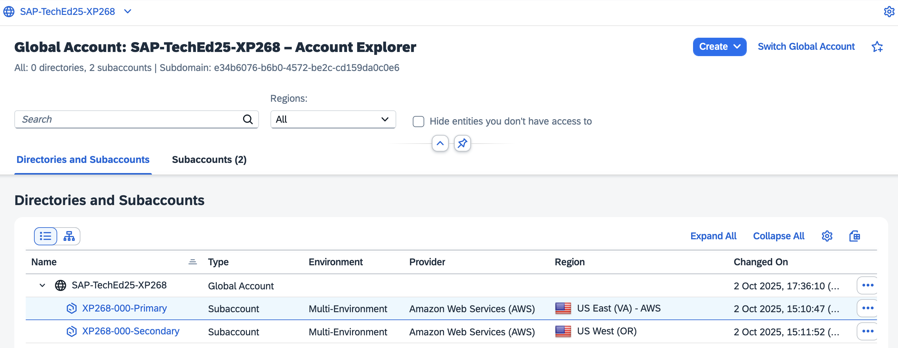
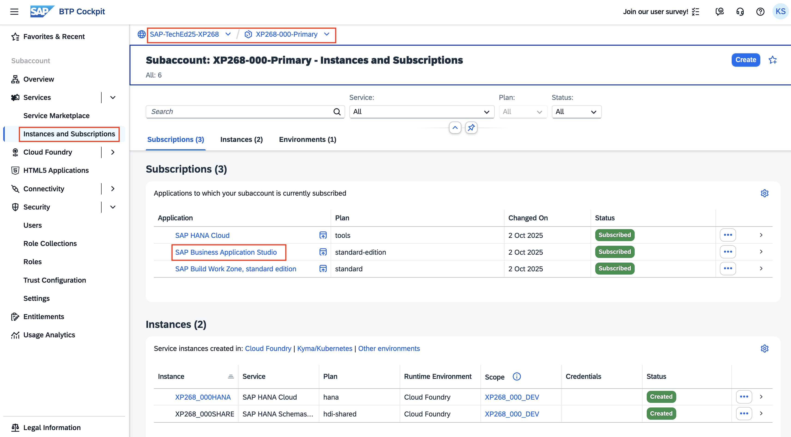
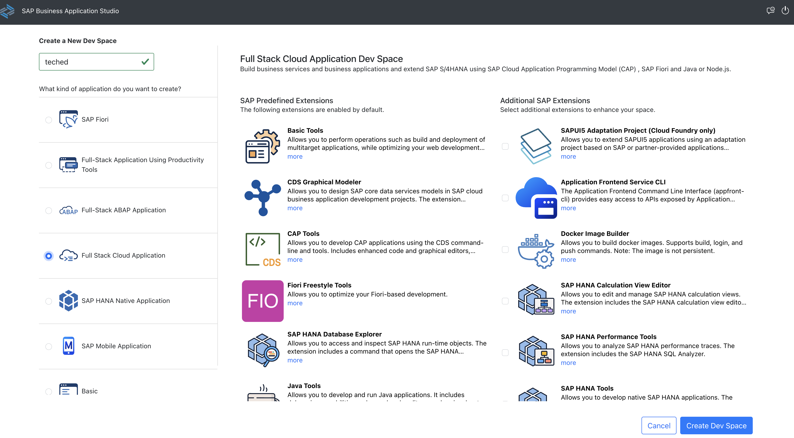
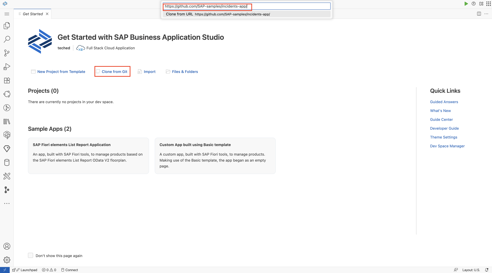
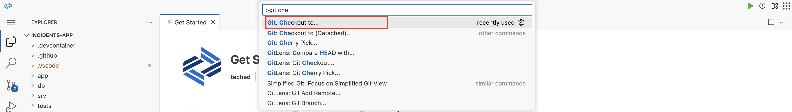
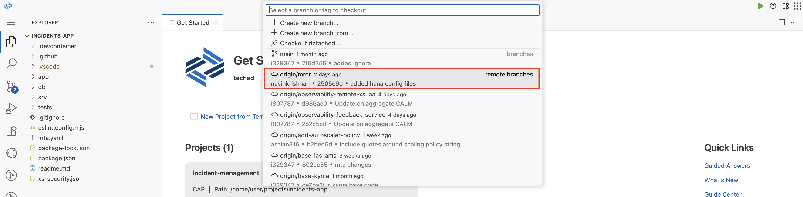
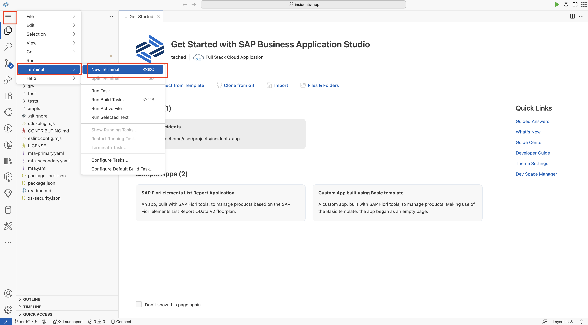
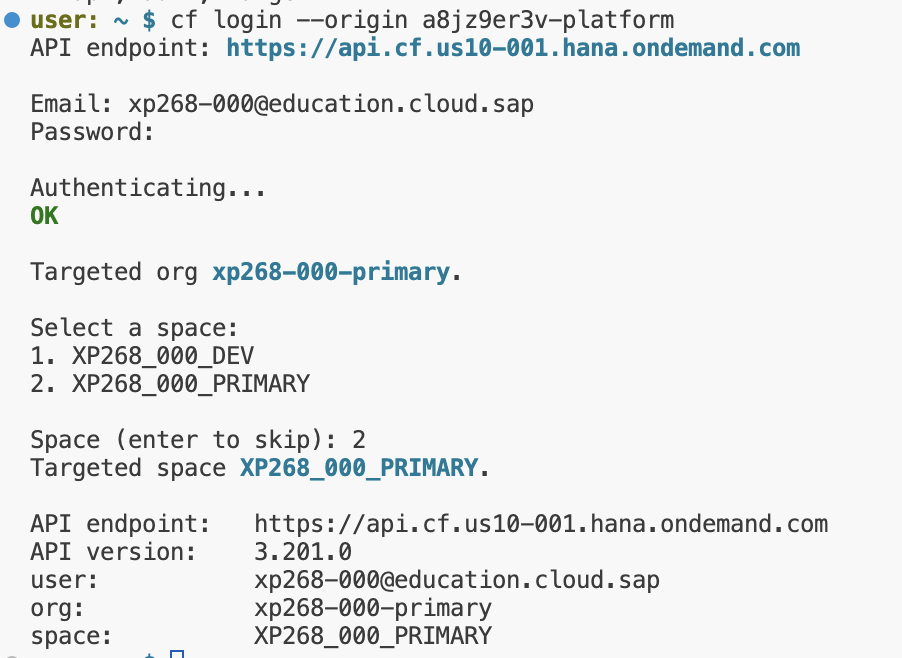

# Exercise 0: Getting Started with SAP BTP Multi-Region Setup

## Overview

SAP Business Technology Platform (BTP) serves as the essential technical foundation for enterprise customers, designed to support mission-critical workloads with resilience against catastrophic regional failures. BTP enables customers to distribute resources across multiple geographic areas, ensuring business continuity when one region becomes unavailable.

### Key Multi-Region Concepts

**Region Pairs**: BTP defines paired regions that are geographically distant from one another while ensuring data remains within the same country or jurisdiction for compliance purposes.

**Subaccount Pairs**: Customers pair two subaccounts belonging to BTP-defined region pairs, with each subaccount associated with a specific region.

**Redundant Setup**: Customers deploy redundant resources in paired subaccounts to maintain service stability. BTP facilitates asynchronous replication to the paired region behind the scenes.

**Instance-Level Failover**: Customers can initiate controlled failovers for individual service instances.

**Subaccount-Level Failover**: Customers can initiate controlled failovers for their subaccounts to protect mission-critical workloads or conduct test drills.

**Regional-Level Failover**: In catastrophic events affecting an entire region, SAP can initiate controlled failovers after a formal disaster claim.

> [!NOTE]  
> **Best Practice**: Customers should segregate their applications, subscriptions, and instances between disaster recovery (DR) and non-DR environments in separate subaccounts.
> 
> **Development Status**: Subaccount-level and regional-level failovers are currently in development.

## Prerequisites ✅

> [!IMPORTANT]  
> All prerequisite configurations and subaccount setups have been completed for this hands-on exercise.

### Subaccount Configuration
For this exercise, the following has been pre-configured:
- **Primary Subaccount**: Main operational environment located in `US10` region
- **Secondary Subaccount**: Standby environment for failover located in `US11` region
- **Region Pairing**: Both subaccounts are in geographically distant regions as per [SAP BTP supported paired regions](https://help.sap.com/docs/BTP/2c674b8190ef4978ba40ba8283cf5adb/13c575c7d11148bd8ac00a71f27da30e.html)
- **Disaster Recovery Pairing**: Subaccounts are configured as a pair in the BTP Central Disaster Recovery Service

### Required Entitlements
The following entitlements have been assigned to both subaccounts:
- SAP HANA Cloud
- SAP HANA Schemas & HDI Containers
- Cloud Foundry Application Runtime
- SAP Build Work Zone

---

# Setup Instructions

## Step 1: Access Your Subaccounts

1. **Obtain Credentials**: Your username and password will be provided by the speaker/moderator. User accounts are numbered sequentially from **xp268-001 to xp268-040**.

2. **Access BTP Cockpit**: Navigate to the [BTP Cockpit](https://emea.cockpit.btp.cloud.sap/cockpit/?idp=a8jz9er3v.accounts.ondemand.com#/globalaccount/e34b6076-b6b0-4572-be2c-cd159da0c0e6&//detail/fe01278e-00bc-45de-b196-2f1a4d3757da/?layout=TwoColumnsMidExpanded)

3. **Verify Subaccounts**: You should see two subaccounts under the global account `SAP-TechEd25-XP268`:
   - `XP268-xxx-Primary` (your primary region)
   - `XP268-xxx-Secondary` (your disaster recovery region)
   
   These subaccounts are already paired to establish BTP multi-region disaster recovery.

<p align="center"> 

</p>

## Step 2: Launch Development Environment

1. **Select Primary Subaccount**: Click on `XP268-xxx-Primary` (replace xxx with your assigned number)

2. **Navigate to Services**: Choose **Instances and Subscriptions**

3. **Verify Available Services**: You should see the following subscriptions:
   - SAP HANA Cloud
   - SAP Business Application Studio
   - SAP Build Work Zone

<p align="center"> 

</p>

## Step 3: Create Development Space

1. **Open SAP Business Application Studio**: Click on the SAP Business Application Studio subscription

2. **Create Dev Space**: 
   - Select `Full Stack Cloud Application` template
   - Click **Create Dev Space**
   - Wait for the dev space to start (this may take a few minutes)

<p align="center"> 

</p>

3. In the getting started page, click on **Clone from Git** and provide the below URL to clone the repository directly into your dev space.

```shell
https://github.com/SAP-samples/incidents-app
```

<p align="center"> 

</p>

4. Open Command Palette (Ctrl+Shift+P or F1) and search for **git checkout to**.

<p align="center"> 

</p>

5. select `origin/mrdr` branch to switch to the multi-region disaster recovery branch.
  
<p align="center"> 

</p>


## Step 5: Configure Cloud Foundry Access - Primary Region

1. **Launch Terminal**: Once the dev space is running, open it and launch a new terminal

<p align="center"> 

</p>


1. **Set API Endpoint**: Connect to the Cloud Foundry API for the US10 region:

```shell
cf api https://api.cf.us10-001.hana.ondemand.com
```

2. **Login to Cloud Foundry**: Use the custom Identity Provider origin:

```shell
cf login --origin a8jz9er3v-platform
```

> [!NOTE]
> **Important**: Do not omit the `--origin` parameter as we are using a custom Identity Provider for authentication.

3. **Provide Credentials**: 
   - Enter your assigned email (username with the correct sequence number)
   - Enter the provided password

4. **Target Organization and Space**: Select the org and space `xp268-xxx-primary` (replace xxx with your sequence number)

<p align="center"> 

</p>

---

## Summary

Congratulations! You have successfully completed the initial setup for SAP BTP Multi-Region hands-on exercise:

 ✅ **Accessed BTP Cockpit** and verified your paired subaccounts
 ✅ **Created SAP Business Application Studio dev space** for development
 ✅ **Launched terminal environment** for command-line operations
 ✅ **Cloned sample application** repository
 ✅ **Configured Cloud Foundry access** to the primary region (US10)
 ✅ **Authenticated and targeted** the correct organization and space

Your development environment is now ready for deploying applications in a multi-region disaster recovery scenario.

**Next Steps**: Proceed to [Exercise 1 - Deploy Application in Primary Region](../ex1/README.md) to deploy your first application.
