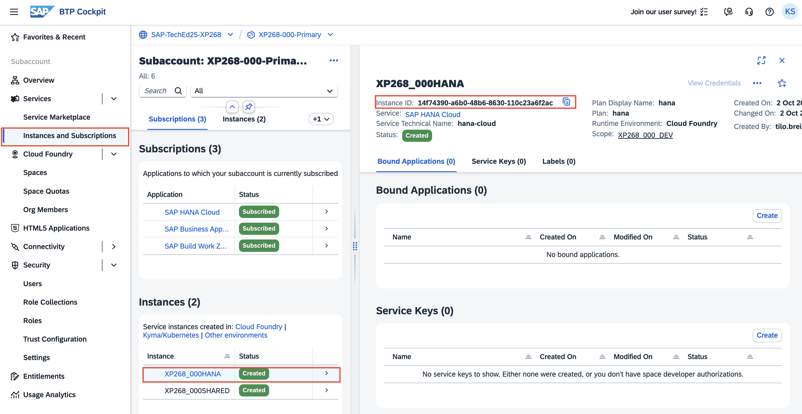
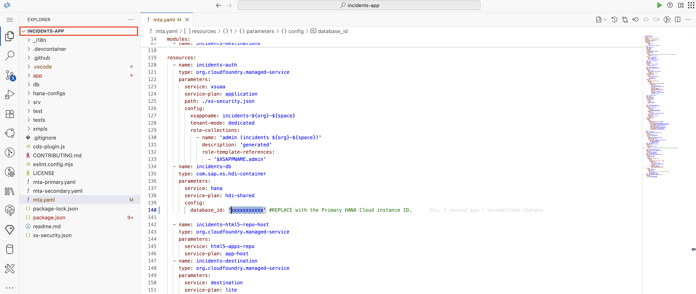
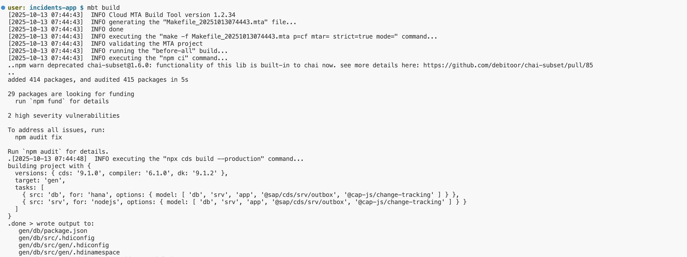
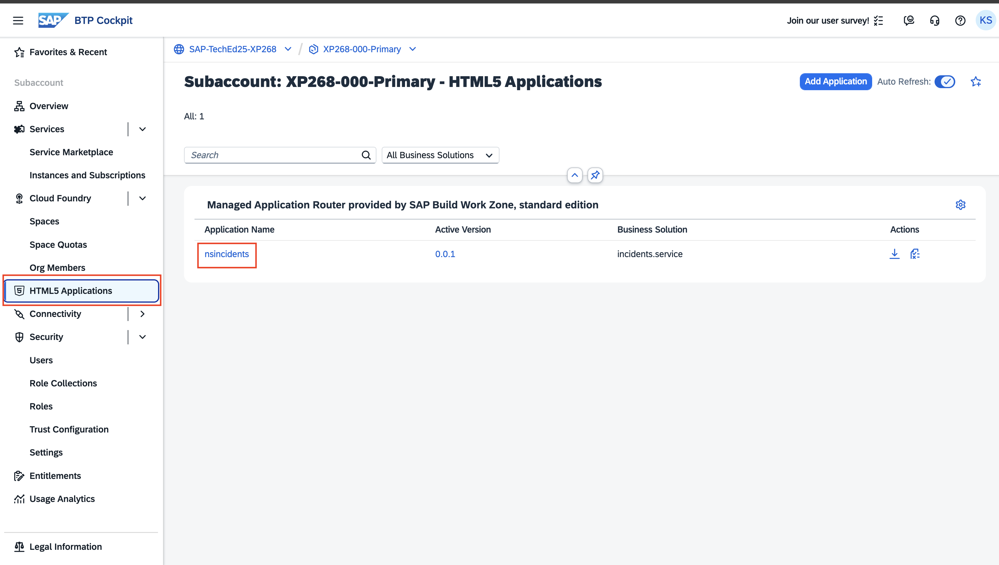
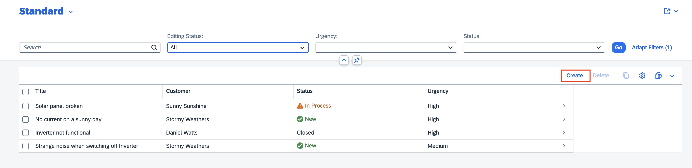
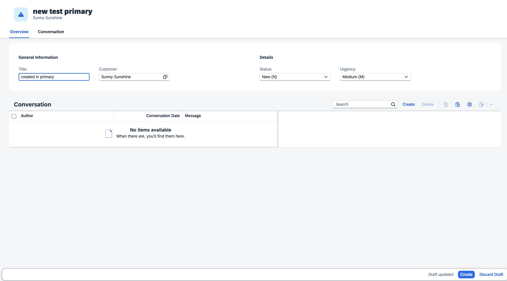

# Exercise 1: Deploy Application in Primary Region

## Overview
In this exercise, you will deploy an incident management application to the primary region. This demonstrates how existing applications can be configured for multi-region disaster recovery without requiring significant changes to the codebase.

## Prerequisites
Before starting, ensure that your HANA service instance is running by verifying the services in your Cloud Foundry environment.

```shell
cf services
```

## Step 1: Configure HANA Cloud Instance

1. Copy the instance ID of your HANA Cloud instance. You can obtain this either from the SAP BTP Cockpit. Primary region Subaccount -> Instances and Subscriptions -> Click on your HANA Cloud instance  -> Copy the `Instance ID`

<p align="center"> 

</p>

2. Open the incident management application and navigate to the `mta.yaml` file.

3. Update the `mta.yaml`: Under resources `incidents-db`,  update the `database_id` parameter with the HANA Cloud instance ID you copied in step 1 and save the file.


<p align="center"> 

</p>

## Step 2: Build MTAR

Generate the Multi-Target Application Archive (MTAR) file by running the following command:

```shell
mbt build
```

<p align="center"> 

</p>

This command will create a deployable archive containing all the necessary application components.

## Step 3: Deploy Primary Application

Deploy the application to your Cloud Foundry space:

```shell
cf deploy mta_archives/capire.incidents_1.0.0.mtar
```

Wait for the deployment to complete successfully.

## Step 4: Access the Application

Once the deployment is successful:

1. Navigate to the SAP BTP Cockpit
2. Go to your subaccount view
3. Click on **HTML5 Applications**
4. Locate and launch the **Incidents** application

<p align="center"> 

</p>

## Step 5: Test the Application

The incident management application provides a simple interface where you can create and manage incidents.

1. **Application Interface**: Explore the main application dashboard

<p align="center"> 

</p>

2. **Create New Incident**: Test the functionality by creating a new incident in the primary region

<p align="center"> 

</p>

> [!IMPORTANT]  
> **Key Observation**: In this exercise, you deployed an application to the primary region without making any specific changes for multi-region disaster recovery. This demonstrates that SAP BTP supports **brownfield scenarios**, meaning existing production and critical workloads can be easily configured for multi-region disaster recovery without changes on the existing primary application setup.

## Summary

In this exercise, you have successfully:
  ✅ Verified your HANA Cloud service instance
  ✅ Configured the application with the correct HANA instance ID
  ✅ Built the Multi-Target Application Archive (MTAR)
  ✅ Deployed the incident management application to the primary region
  ✅ Accessed and tested the application functionality
  ✅ Observed how SAP BTP supports brownfield disaster recovery scenarios

You have now established the foundation application in the primary region, which will serve as the basis for implementing multi-region disaster recovery in the subsequent exercises.

**Next Steps**: Continue to [Exercise 2 - Disaster Recovery Configuration](../ex2/README.md) to learn how to configure disaster recovery for your application.

