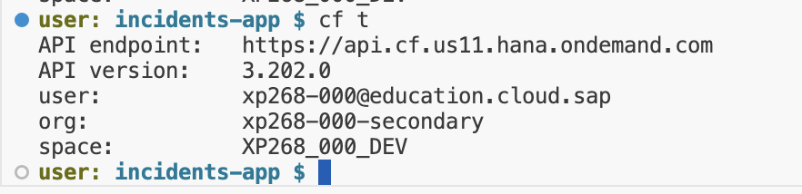
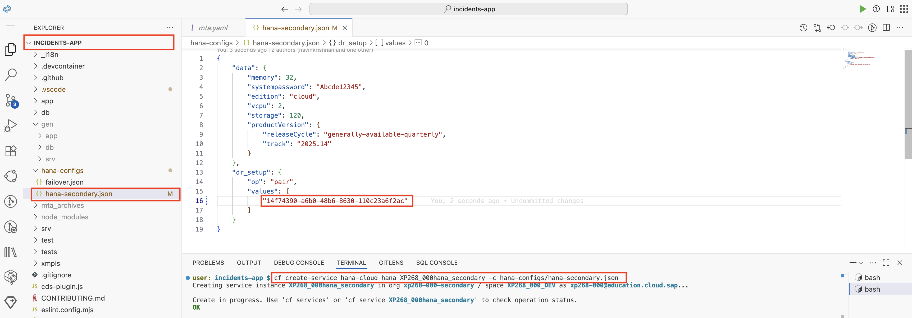
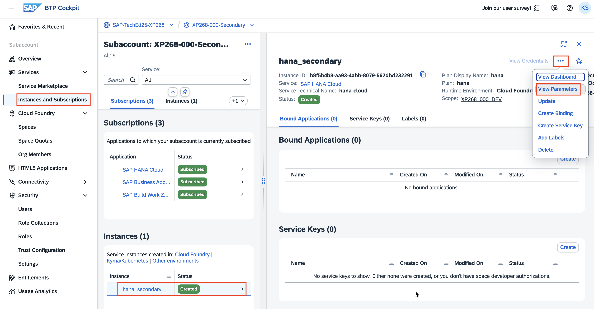
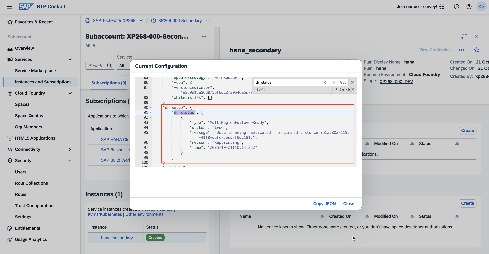

# Exercise 2: Configure Secondary Instance and Establish Data Replication

## Overview

In this exercise, you will establish the foundation for disaster recovery by creating a secondary HANA Cloud instance in the secondary region and configuring it to replicate data from the primary region. This setup ensures that your data is continuously synchronized across regions, enabling rapid failover capabilities.

### Key Objectives

- Configure Cloud Foundry access for the secondary region (US11)
- Create a secondary HANA Cloud instance with pairing to the primary instance
- Verify that data replication is active and functioning correctly

---

## Step 1: Configure Cloud Foundry Access - Secondary Region

### 1.1 Set API Endpoint for Secondary Region

Connect to the Cloud Foundry API for the **US11** region (secondary region):

```bash
cf api https://api.cf.us11.hana.ondemand.com
```

### 1.2 Authenticate with Cloud Foundry

Login using the custom Identity Provider origin:

```bash
cf login --origin a8jz9er3v-platform
```

> [!NOTE]
> **Important**: Do not omit the `--origin` parameter as we are using a custom Identity Provider for authentication.

### 1.3 Provide Authentication Credentials

1. **Enter your assigned email**: Use your username with the correct sequence number
2. **Enter the provided password**: Use the password given by the instructor

### 1.4 Target Secondary Organization and Space

1. **Select Organization and Space**: Choose the org and space `xp268-xxx-secondary` (replace xxx with your assigned sequence number)

2. **Verify Target Configuration**: Confirm you are in the correct space by running:

```bash
cf target
```

**Expected Output**: You should see output similar to this, confirming you're targeting the secondary region:

<p align="center">

</p>

---

## Step 2: Create Secondary HANA Cloud Instance with Pairing

### 2.1 Locate Configuration File

In your project workspace, navigate to the `hana-configs` folder where you'll find the `hana-secondary.json` file. This file contains the pre-configured parameters needed to create a secondary HANA Cloud instance with pairing to the primary instance.

### 2.2 Get Primary HANA Cloud Instance ID

1. **Access Primary Subaccount**:
   - Open SAP BTP Cockpit in a new browser tab/window
   - Navigate to your **primary region subaccount** (XP268-xxx-Primary)
   - Go to **Instances and Subscriptions**

2. **Copy Primary Instance ID**:
   - Locate your HANA Cloud instance
   - Click on the instance to view details
   - Copy the `Instance ID`

### 2.3 Update Configuration File

1. **Open Configuration File**: Navigate to `hana-configs/hana-secondary.json`

2. **Update Instance ID**: Replace the placeholder `<REPLACE_WITH_PRIMARY_HANA_INSTANCE_ID>` with your primary HANA Cloud instance ID

<p align="center"> 

</p>

3. **Save the File**: Ensure the configuration file is saved with the correct instance ID

### 2.4 Create Secondary HANA Cloud Instance

Execute the following command to create the secondary HANA Cloud instance with pairing:

```bash
cf create-service hana-cloud hana hana_secondary -c hana-configs/hana-secondary.json
```

### 2.5 Monitor Instance Creation

1. **Navigate to BTP Cockpit**: Go to your **secondary region subaccount**
2. **Check Instance Status**: Under **Instances and Subscriptions**, you should see the new secondary HANA Cloud instance being created
3. **Monitor Progress**: The instance will show "Creation in Progress" status

<p align="center">

</p>

> [!NOTE]
> **Processing Time**: This operation typically takes 5-10 minutes to complete. HANA Cloud instance creation and pairing configuration requires time to provision resources and establish secure connections between regions.

---

## Step 3: Verify Data Replication Status

### 3.1 Wait for Instance Creation Completion

Before verifying replication status, ensure that the secondary HANA Cloud instance creation has completed successfully. You can monitor this in the BTP Cockpit under **Instances and Subscriptions**.

### 3.2 Access Instance Parameters

1. **Navigate to Secondary Instance**:
   - In the secondary region subaccount
   - Go to **Instances and Subscriptions**
   - Locate your secondary HANA Cloud instance

2. **View Instance Parameters**:
   - Click the three dots (⋯) next to your secondary HANA Cloud instance
   - Select **View Parameters**

### 3.3 Verify Disaster Recovery Status

1. **Search for DR Status**: In the parameters view, search for `dr_status`

2. **Confirm Replication**: You should see a status indicating active replication between the primary and secondary instances

<p align="center">

</p>

### 3.4 Cross-Verify with Primary Instance

For complete verification:

1. **Check Primary Instance**: Navigate to your primary region subaccount
2. **View Parameters**: Check the `dr_status` field in the primary HANA Cloud instance parameters
3. **Confirm Status**: Both instances should show status as `Replicating`, indicating successful pairing and replication

> [!IMPORTANT]
> **Success Criteria**: When both primary and secondary HANA Cloud instances show `dr_status` as `Replicating`, you have successfully:
> - ✅ Established secure connection between regions
> - ✅ Configured data replication from primary to secondary
> - ✅ Created the foundation for disaster recovery capabilities

---

## Summary

Excellent progress! You have successfully established the data layer foundation for your multi-region disaster recovery solution. In this exercise, you accomplished:

 ✅ **Configured Cloud Foundry access** for the secondary region (US11)
 ✅ **Created secondary HANA Cloud instance** with proper configuration
 ✅ **Established pairing** between primary and secondary HANA instances
 ✅ **Verified active replication** status across both regions
 ✅ **Confirmed disaster recovery readiness** at the database level

### Key Achievements

🎯 **Data Replication**: Your data is now continuously synchronized between the US10 (primary) and US11 (secondary) regions.

With the secondary HANA Cloud instance successfully created and replication active, you're ready to proceed with deploying the application layer to the secondary region.

**Next Steps**: Continue to [Exercise 3 - Deploy Application in Secondary Region for Disaster Recovery](../ex3/README.md) where you'll deploy the incident management application to the secondary region in a stopped state, ready for failover activation.
