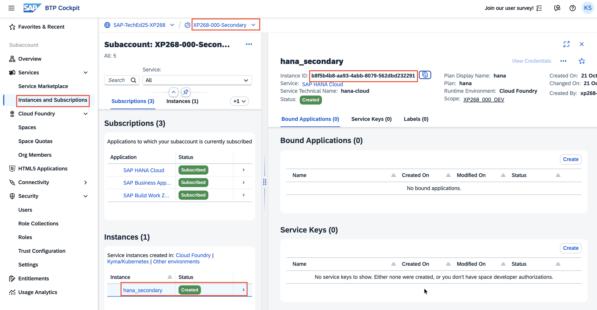
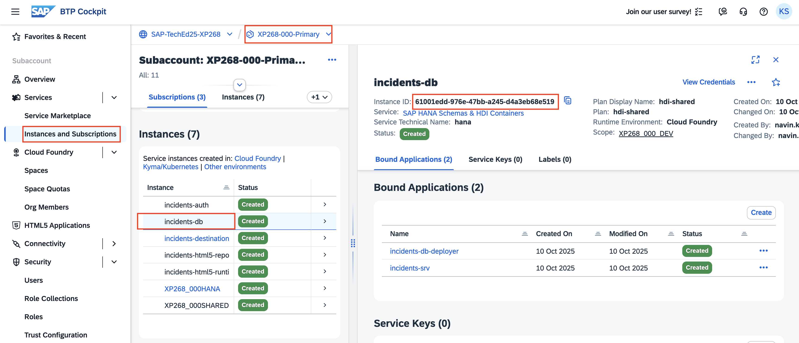
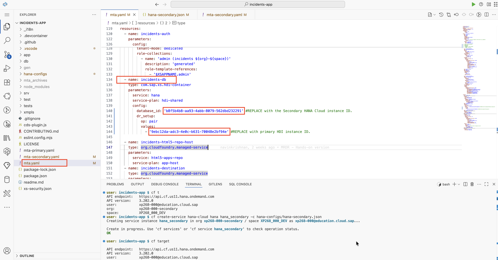

# Exercise 3: Deploy Application in Secondary Region for Disaster Recovery

## Overview

In this exercise, you will deploy the incident management application to the secondary region in a stopped state. This configuration is crucial for disaster recovery scenarios, as it enables rapid failover capabilities when the primary region becomes unavailable. The stopped state ensures that the application is ready for activation without consuming unnecessary resources during normal operations.

### Key Concepts

- **Stopped State Deployment**: Applications are deployed but not running, conserving resources while maintaining readiness
- **HDI Container Pairing**: Database containers are configured to replicate data from the primary region
- **Disaster Recovery Configuration**: Specialized MTA configurations optimize the setup for secondary region deployment

---

## Step 1: Verify Secondary Region Cloud Foundry Target

### 1.1 Confirm Current Target

Ensure you are targeting the Cloud Foundry space for your secondary region (`xp268-xxx-secondary`).

**Verify your current target:**
```bash
cf target
```

**Expected Output:** You should see the CF API endpoint, organization, and space for your secondary region:

<p align="center">

</p>

> [!NOTE]
> If you're not targeting the secondary region, please refer to Exercise 2, Step 1 for instructions on switching to the secondary region Cloud Foundry space.

---

## Step 2: Configure MTA for Secondary Region Deployment

### 2.1 Understand MTA Configuration Differences

The secondary region requires a specialized MTA configuration that differs from the primary region setup:

1. **Copy Secondary MTA Configuration**: Replace the content of `mta.yaml` with the content from `mta-secondary.yaml`. This file is pre-configured with the necessary parameters for disaster recovery setup.

2. **Key Configuration Differences**: 
   - The `db-deployer` module is commented out in the secondary MTA file
   - **Reason**: We don't want to create a new HDI container in the secondary region since data is replicated from the primary region
   - **Benefit**: This approach leverages existing data replication rather than initializing new schemas and tables

### 2.2 Required Configuration Updates

Before deploying, you need to update two critical fields in the `mta.yaml` file:
- **Secondary HANA Cloud Instance ID**
- **Primary Region HDI Container Instance ID** (for pairing configuration)

---

## Step 3: Obtain Required Instance IDs

### 3.1 Get Secondary HANA Cloud Instance ID

1. **Navigate to Secondary Subaccount**:
   - Open SAP BTP Cockpit
   - Go to your secondary region subaccount
   - Click on **Instances and Subscriptions**

2. **Copy Instance ID**:
   - Locate the HANA Cloud instance you created in Exercise 2
   - Click on the instance to view details
   - Copy the `Instance ID`

<p align="center">

</p>

3. **Update MTA Configuration**:
   - In the `mta.yaml` file, locate the resource `incidents-db`
   - Update the `database_id` parameter with the Secondary HANA Cloud Instance ID

### 3.2 Get Primary HDI Container Instance ID

1. **Navigate to Primary Subaccount**:
   - Open SAP BTP Cockpit in a new tab/window
   - Go to your primary region subaccount
   - Click on **Instances and Subscriptions**

2. **Copy HDI Container Instance ID**:
   - Locate the HDI container instance named `incidents-db`
   - Click on the instance to view details
   - Copy the `Instance ID`

<p align="center">

</p>

3. **Update MTA Configuration**:
   - In the `mta.yaml` file, locate the resource `incidents-hdi`
   - Update the `dr_setup` parameter value with the Primary HDI Container Instance ID

### 3.3 Verify Configuration

After updating both instance IDs, your `mta.yaml` file should look similar to this:

<p align="center"> 

</p>

**Save the file** before proceeding to the next step.

---

## Step 4: Build and Deploy Application

### 4.1 Build MTAR Archive

Generate the Multi-Target Application Archive (MTAR) file:

```bash
mbt build
```

Wait for the build process to complete successfully.

### 4.2 Deploy in Stopped State

Deploy the application to the secondary region using the `--no-start` parameter:

```bash
cf deploy mta_archives/capire.incidents_1.0.0.mtar --no-start
```

> [!IMPORTANT]
> **The `--no-start` Parameter**: This ensures that the application is deployed but not started, which is essential for disaster recovery scenarios. The application will remain in a stopped state until explicitly started during a failover event.

### 4.3 Verify Deployment

1. **Check Application Status**:
   - Navigate to SAP BTP Cockpit
   - Go to your secondary subaccount
   - Under **Cloud Foundry** → **Spaces**, select your space
   - Verify that the application appears in a **stopped state**

2. **Verify HDI Container Replication**:
   - In **Instances and Subscriptions**, locate the HDI container instance `incidents-db`
   - Click on the instance to view parameters
   - Search for the `dr_status` parameter
   - Confirm it shows `Replicating` state, indicating active replication from the primary HDI container

---

## Summary

Excellent work! You have successfully configured and deployed the incident management application to the secondary region for disaster recovery. In this exercise, you accomplished:

 ✅ **Verified secondary region targeting** for Cloud Foundry operations
 ✅ **Configured specialized MTA** for disaster recovery deployment
 ✅ **Updated instance IDs** for both HANA Cloud and HDI container pairing
 ✅ **Built application archive** with secondary region configuration
 ✅ **Deployed application in stopped state** to conserve resources while maintaining readiness
 ✅ **Verified replication status** confirming data synchronization with primary region

### Key Achievements

🎯 **Disaster Recovery Readiness**: Your application is now deployed and ready for rapid activation in case of primary region failure.

🎯 **Data Replication**: HDI container pairing ensures continuous data synchronization between regions.

Your multi-region disaster recovery setup is now complete and ready for testing. The secondary region contains a fully configured application that can be activated quickly during a disaster recovery scenario.

**Next Steps**: Continue to [Exercise 4 - Trigger Failover to Secondary Region](../ex4/README.md) to test the complete disaster recovery process.