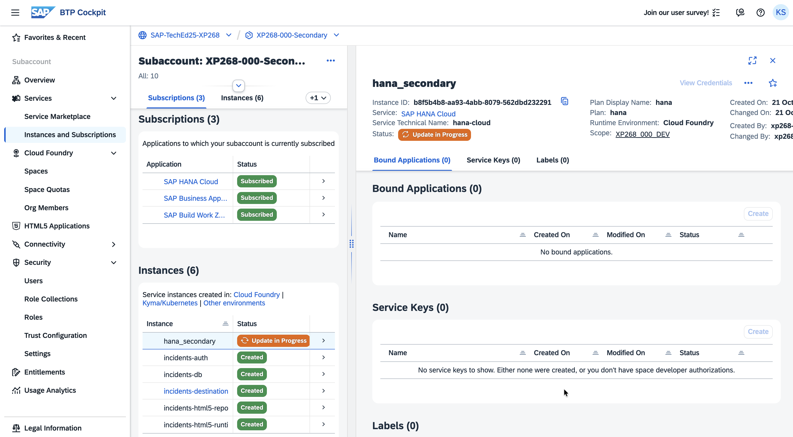
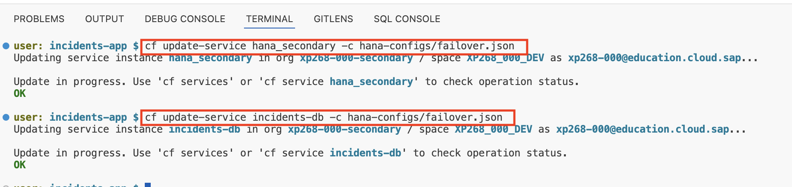
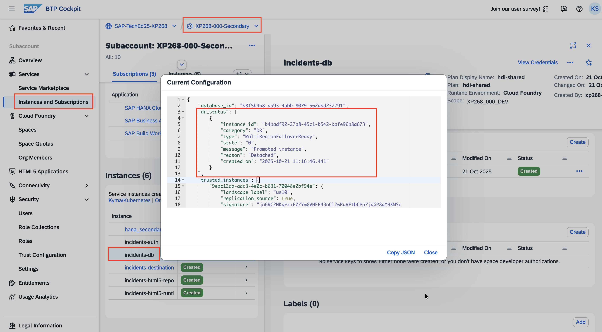
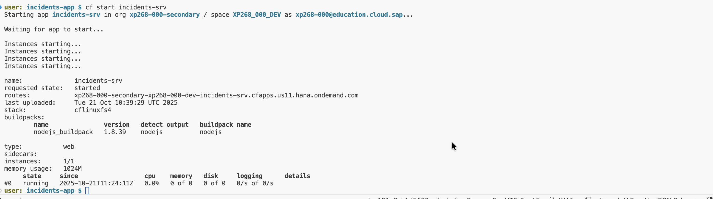

# Exercise 4: Trigger Failover to Secondary Region

## Overview

In this exercise, you will simulate a disaster recovery scenario by executing a controlled failover process to switch operations from the primary region to the secondary region. This demonstrates how the incident management application can continue to function seamlessly in the event of a regional outage, ensuring business continuity.

### Important: Failover Hierarchy

There is a specific hierarchy that must be maintained when performing failover operations:

1. **HANA Cloud Instance** failover first
2. **HDI Container** failover second  
3. **Application startup** last

Following this sequence ensures proper data consistency and service availability during the disaster recovery process.

## Prerequisites

Before starting this exercise, ensure you are targeting the secondary region Cloud Foundry space.

**Verify Current Target:**
```bash
cf target
```

You should see output similar to this, confirming you're in the secondary region:

<p align="center">

</p>

If you're not in the secondary region, please refer to Exercise 2 for instructions on switching to the secondary region.

---

## Step 1: Trigger Failover for HANA Cloud Instance

### 1.1 Locate Failover Configuration

Navigate to the `hana-configs` folder in your project workspace. You will find the `failover.json` file, which contains the configuration parameters required to trigger failover for the secondary HANA Cloud instance.

### 1.2 Execute HANA Cloud Failover

Trigger the failover for the secondary HANA Cloud instance using the following command:

```bash
cf update-service hana_secondary -c hana-configs/failover.json
```

> [!NOTE]
> **Processing Time**: This operation may take several minutes to complete as the failover process involves promoting the secondary instance to become the new primary instance and updating all internal configurations.

### 1.3 Monitor Failover Progress

1. **Monitor via Command Line**: The command will show progress updates in the terminal.

2. **Monitor via BTP Cockpit**: 
   - Navigate to the SAP BTP Cockpit
   - Go to your secondary subaccount
   - Click on **Instances and Subscriptions**
   - Locate your secondary HANA Cloud instance
   - You should see an "Update in Progress" status

<p align="center">

</p>

### 1.4 Verify HANA Cloud Failover Completion

Once the update is complete:

1. In the SAP BTP Cockpit, click on your secondary HANA Cloud instance
2. Navigate to the instance parameters
3. Search for the `dr_status` parameter
4. Verify that the status shows `Detached`, indicating successful failover

<p align="center">

</p>

---

## Step 2: Trigger Failover for HDI Container

### 2.1 Execute HDI Container Failover

Now that the HANA Cloud instance failover is complete, proceed with the HDI container failover using the same configuration file:

```bash
cf update-service incidents-db -c hana-configs/failover.json
```

<p align="center">

</p>

### 2.2 Monitor HDI Container Failover

1. **Wait for Completion**: Allow the failover process to complete. This typically takes a few minutes.

2. **Monitor Progress**: You can monitor the status in the SAP BTP Cockpit:
   - Navigate to **Instances and Subscriptions**
   - Locate your HDI container instance (`incidents-db`)
   - Monitor the update status

### 2.3 Verify HDI Container Failover Completion

1. Once the update is complete, click on the HDI container instance (`incidents-db`)
2. Navigate to the instance parameters
3. Search for the `dr_status` parameter
4. Verify that the status shows `Detached`, confirming successful HDI container failover

<p align="center">

</p>

---

## Step 3: Start the Application in Secondary Region

### 3.1 Start the Application Service

Now that both the HANA Cloud instance and HDI container failovers are complete, you can start the incident management application in the secondary region:

```bash
cf start incidents-srv
```

<p align="center">

</p>

Wait for the application to start successfully. The command output will show when the application is running.

### 3.2 Access the Application

1. **Navigate to BTP Cockpit**: Open the SAP BTP Cockpit
2. **Go to Secondary Subaccount**: Select your secondary region subaccount
3. **Access HTML5 Applications**: Click on **HTML5 Applications**
4. **Launch Application**: Find and launch the **Incidents** application

### 3.3 Verify Data Continuity

Test the disaster recovery by verifying that the incident data created in the primary region is now available in the secondary region:

1. **Check Existing Data**: Look for the incident(s) you created in Exercise 1 while operating in the primary region
2. **Verify Functionality**: Confirm that you can view, edit, and create new incidents
3. **Test Application Features**: Ensure all application functionality works as expected

---

## Summary

Congratulations! You have successfully completed a controlled disaster recovery failover scenario. In this exercise, you:

  ✅ **Executed HANA Cloud failover** from primary to secondary region
  ✅ **Performed HDI container failover** following the correct sequence
  ✅ **Started the application** in the secondary region
  ✅ **Verified data continuity** across regions during failover
  ✅ **Confirmed business continuity** by accessing the application with preserved data
  ✅ **Demonstrated complete disaster recovery** capabilities

### Key Achievements

🎯 **Business Continuity**: Your mission-critical application continued to operate without data loss during a simulated regional outage.

🎯 **Successful Failover**: You've proven that SAP BTP's multi-region disaster recovery solution can protect your critical workloads.

🎯 **Operational Readiness**: You now understand the complete process for executing disaster recovery procedures in a real-world scenario.

This completes the SAP BTP Multi-Region Disaster Recovery hands-on. You now have the knowledge and experience to implement and manage disaster recovery solutions for mission-critical applications on SAP BTP.
